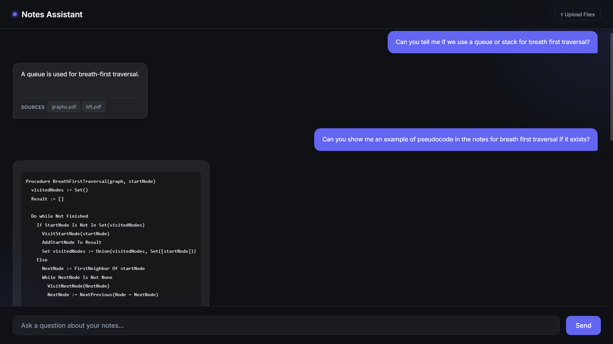

# Notes Assistant

A fully local RAG-based study assistant. Drop in PDFs, Markdown, or text files and chat with them — no API keys, no cloud, no data leaving your machine.

Built as a weekend proof-of-concept to explore local LLM tooling.



---

## How it works

1. **Ingest** — documents are chunked and embedded using a local Ollama model, then stored in a persistent ChromaDB vector index on disk.
2. **Query** — the frontend sends a question to the FastAPI backend, which retrieves the top-k most relevant chunks and passes them as context to a local LLM.
3. **Answer** — the LLM responds using only the retrieved context, so answers stay grounded in your documents.

Everything runs locally. The only network calls are to `localhost:11434` (Ollama).

---

## Stack

| Layer | Technology |
|---|---|
| LLM | [Ollama](https://ollama.com) — `llama3.2:1b` (local) |
| Embeddings | Ollama — `nomic-embed-text` (local) |
| RAG pipeline | [LlamaIndex Core](https://github.com/run-llama/llama_index) 0.14.x |
| Vector store | [ChromaDB](https://www.trychroma.com) — persistent on-disk |
| Backend | FastAPI + Uvicorn |
| Frontend | Vanilla HTML / CSS / JS — no frameworks, no build step |

---

## Features

- **Drag-and-drop upload** — drop `.pdf`, `.md`, or `.txt` files directly in the browser; they're embedded and queryable immediately
- **Reingest** — rebuild the full index from all docs in one click
- **Markdown rendering** — assistant responses render code blocks, lists, and inline code
- **Fully offline** — no OpenAI, no Anthropic, nothing external

---

## Setup

**Prerequisites:** Python 3.13, [Ollama](https://ollama.com) installed and running.

```bash
# Pull the required models
ollama pull llama3.2:1b
ollama pull nomic-embed-text

# Clone and set up the environment
git clone https://github.com/your-username/notes-assistant
cd notes-assistant
python -m venv venv
.\venv\Scripts\Activate      # Windows PowerShell
pip install -r requirements.txt
```

**Optional — pre-build the index from existing files:**
```bash
# Drop files into docs/, then:
cd backend && python ingest.py
```

**Start the server:**
```bash
cd backend && uvicorn main:app --reload --port 8000
```

Open [http://localhost:8000](http://localhost:8000). Use the **Upload Files** panel to add documents, then ask questions.

---

## Project structure

```
notes-assistant/
├── backend/
│   ├── config.py      # model names, paths, chunk settings
│   ├── ingest.py      # one-shot index builder (CLI)
│   └── main.py        # FastAPI app — /ask, /upload, /reingest, /files
└── frontend/
    └── index.html     # self-contained chat UI
```

---

## API

| Endpoint | Method | Description |
|---|---|---|
| `/ask` | POST | Query the index — `{ "query": "..." }` |
| `/upload` | POST | Upload files (multipart/form-data) — embeds immediately |
| `/reingest` | POST | Rebuild the full index from `docs/` |
| `/files` | GET | List documents currently in `docs/` |
| `/health` | GET | Liveness check |

---

## Switching models

ChromaDB locks a collection to the embedding dimension it was first built with. To change `EMBED_MODEL` in `config.py`:

```bash
rm -r storage/          # delete the old index
python backend/ingest.py  # rebuild with the new model
```

Available locally via Ollama: `llama3.2:1b` (fast, 1.3 GB), `mistral` (4.4 GB), `gemma4` (9.6 GB).
